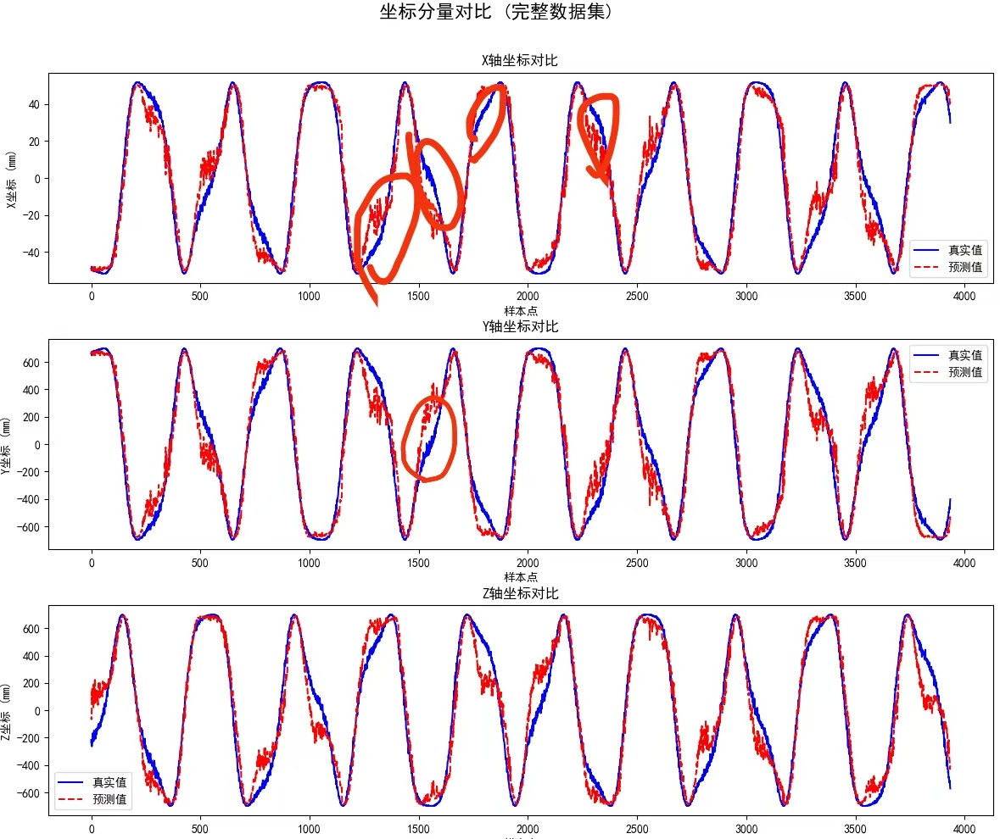
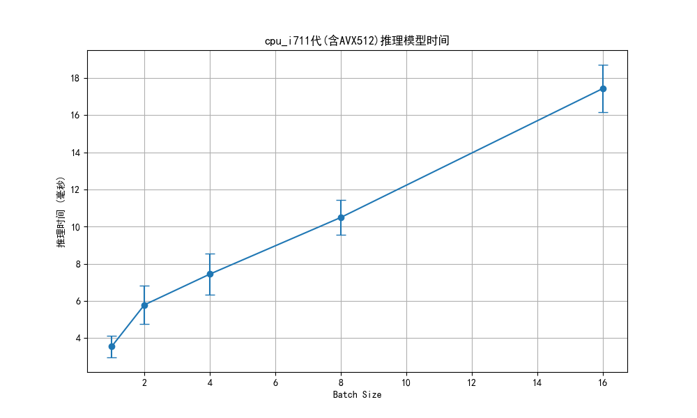
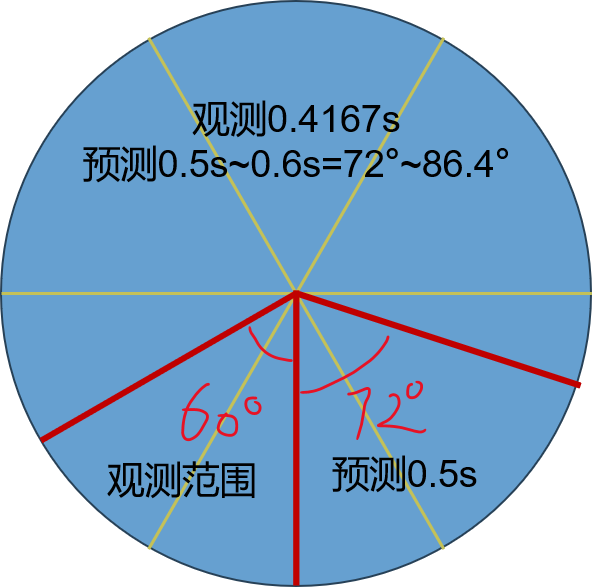
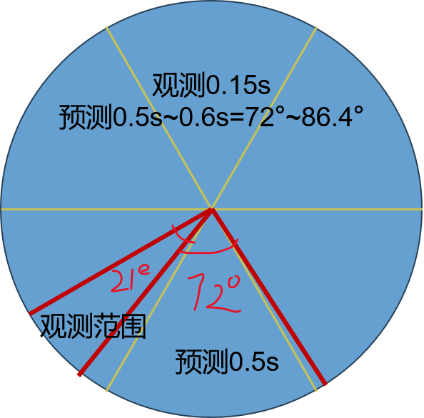

# 代码的结构
- block.py是模型的主体代码，包含了模型的定义。
- train.py是模型的训练代码，包含了模型的训练和验证过程。
- loss.py是模型的损失函数代码，包含了模型的损失函数的定义。
- predicted.py是模型的测试代码，包含了模型的测试和评估过程。
- export.py是模型的导出openvino模型的代码，包含了模型的导出过程。
- utils是模型的工具函数代码，包含了模型的工具函数的定义。其中generate_dataset.py是模拟数据集的生成代码，包含了模拟数据集的生成过程。
# python 环境部署
- pip install -r requirements.txt
# 模型的结构
```mermaid
 graph TD
     A[输入数据 batch,seq_len,7] --> B[Encoders特征提取]
     B -->|编码特征| C[pre_coords坐标预测分支]
     B -->|编码特征| D[class_fc分类预测分支]
     
 
     subgraph pre_coords坐标预测分支
         C --> C1[平移分支trans_fc]
         C --> C2[旋转分支rot_fc]
         C --> C3[半径预测radius_fc]
         C --> C4[装甲板初始角度预测]
         C2 --> |rot_vec| C5[生成旋转矩阵R]
         C3 --> C6[球坐标转换]
         C4 --> C6
         C6 --> C7[初始点p0]
         C5 --> C8[旋转点Rp0]
         C7 --> C8
         C1 --> C9[坐标合成]
         C8 --> C9
     end
     
     subgraph class_fc分类预测分支
         D --> D1[时间步压缩CBS_1D]
         D1 --> D2[Sigmoid分类]
     end
     
     subgraph 输出部分
         C9 -->|pred_coords| E[最终坐标 batch,pred_len,3]
         C1 -->|trans_out| F[平移输出 batch,pred_len,3]
         C2 -->|rot_vec| G[旋转参数 batch,pred_len,3]
         C3 -->|radius_pred| H[半径预测 batch,pred_len,1]
         D2 -->|class_pred| I[类别概率 batch,pred_len,1]
     end
 
     subgraph Encoders结构
         B1[线性投影 7→d_model]
         B1 --> B2[多层Transformer编码器]
         B2 -->|输出| B3[编码特征 batch,seq_len,d_model]
     end
     
     style A fill:#f0f,stroke:#333
     style B fill:#FF9,stroke:#333
     style B3 fill:#9f9,stroke:#333
     style C fill:#99f,stroke:#333
     style C1 fill:#99f,stroke:#333
     style C2 fill:#99f,stroke:#333
     style C3 fill:#99f,stroke:#333
     style C4 fill:#99f,stroke:#333
     style D fill:#99F,stroke:#333
     style E fill:#f09,stroke:#333
 ```
# 数据集的生成

## 真实数据集的采集和使用
- c++可以用cnpy库收集数据，数据的格式为npy格式，数据的格式
- c++代码cnpy的使用方法举例 但是收集的类别名称需要变成t,x，y，z，rot或者修改train.py中的create_dataset函数读取数据格式
```cpp
        if (!all_tvecs.empty() && save_data && all_tvecs.size() % 100 == 0)
        {
            // 转换tvec数据格式
            std::vector<double> flat_tvecs;
            for (const auto &tvec : all_tvecs)
            {
                flat_tvecs.insert(flat_tvecs.end(), tvec.begin(), tvec.end());
            }

            // 转换时间戳数据
            std::vector<double> timestamps(all_timestamps.begin(), all_timestamps.end());

            // 创建形状向量（使用size_t类型）
            std::vector<size_t> tvec_shape = {all_tvecs.size(), 3};
            std::vector<size_t> ts_shape = {all_timestamps.size()};

            // 保存到npz文件
            cnpy::npz_save("tvec_data.npz", "tvecs", flat_tvecs.data(), tvec_shape, "w"); // 就是修改这里的名字
            cnpy::npz_save("tvec_data.npz", "timestamps", timestamps.data(), ts_shape, "a"); // 就是修改这里的名字

            std::cout << "Saved " << all_tvecs.size() << " samples" << std::endl;
        }
```
- 收集数据的是自身车坐标系下可以识别到的从红色点到绿色的时间戳，平移向量和旋转向量，预测的是装甲板坐标系下的红点的3d坐标。
- 数据的输入是先进行[t-t[0],x-x[0],y-y[0],z-z[0],rot旋转向量]的去处初始位置的预处理，然后输入模型，模型输出的是预测的坐标数据，旋转向量，平移向量，半径和分类，分类分支可以保留也可以去除。
- train.py中需要调节的参数的是config的配置参数，学习率采用的是余项退火初始学习率为5e-4，最小学习率为1e-4。
## 测试和仿真(生成的车辆坐标系xyz轴数据)
- 数据集的生成是通过对真实数据进行观察和统计，采用直接生成的方式。x和z的标准差在4mm左右，y的标准差在10mm左右。
- 其中包括小陀螺旋转与否以及其的方向，小陀螺旋转速度，车的随机初始位置，车上坡与否(决定y轴是否赋予速度)，车的速度，车的加速度等。
- 对三轴加了时间噪声，空间噪声。
- 其中时间噪声赋予为小陀螺角度随机噪声(用一帧时间(默认$\ dt=0.015s$,随机时间扰动$\pm2ms$)生成观察角度，模仿摄像头随机观测扰动等)，空间噪声赋予为小陀螺位置高斯噪声(其中包括z和x轴的$\sigma=1$，以及y轴的$\sigma=2$)。
- 模型训练时只做了$\ 第j样本的第i个点-第j样本的第1个点$的去处初始位置的预处理，因此模型推理时要自己这样预处理，输入模型，然后再将位置恢复到原来的位置。
### 注:模型未采用归一化等数据预处理方法，原因是数据集的生成是通过对真实数据进行观察和统计，采用直接生成的方式，因此数据集本身就已经是一个较好的分布。而且模型本身输入为tzxy数据，其中的xyz的量纲均是mm没有量纲差距，输入时便做了交叉项的特征工程，因此在尝试各种数据预处理后此种简单数据预处理是能使模型预测精度达到最优效果的方法。

# 数据集的分配
- 数据集分为训练集和验证集，训练集用于模型的训练，验证集用于模型的验证。
- 训练集和验证集的划分比例为8:2。
- 其中数据集每个类别起码需要4000个样本。
# 训练方法
- 模型训练时采用的是Adam优化器，学习率采用的是余项退火初始学习率为5e-4，最小学习率为1e-4。
# 训练损失权重分配
- 训练损失权重是一个超参数，用于平衡不同损失函数在训练过程中的影响力。
- 因此要平衡各个损失函数的权重，以确保模型在训练时不会过于偏向某个特定的损失函数，同时为了加速模型的收敛，刚开始一直训练到模型收敛为止。
## 具体超参数分配如下:
### 1. 训练初期
- 模型根据此权重收敛后，loss会趋于平稳，loss的值会在一个范围内波动。此时预测的半径，旋转向量，平移向量，坐标数据等都能达到一个很不错的效果。
- coord_loss_weight=1.0, rot_loss_weight=10000.0, theta_loss_weight=5000.0
### 2. 训练后期
- 为使得模型达到最优效果，此时只关注坐标损失即可。虽然因此会导致模型对旋转向量，平移向量，半径等的预测精度下降，但是由于模型是为了预测坐标数据，因此只关注坐标损失即可。
- coord_loss_weight=1.0, 其它权重=0.0
# 模型推理
- 模型推理时，输入数据为[t,z,x,y,rot]的七维数据，模型输出为坐标数据，旋转向量，平移向量，半径，分类数据。仅使用输出的坐标数据即可，在export.py中导出的模型仅保留了坐标预测的返回项。
- 记得要保留收集的模型输入长度的初始位置数据，模型推理后要将目标装甲板坐标系下的数据恢复到原来自身车辆坐标系下的位置。
- 此时便得到了三维自身车体坐标系下的要预测的坐标数据。
- 其中默认你会得到$predlen = 10$个预测点，默认对应的是未来的$[offset*dt,(offset+predlen)*dt]=[40*dt，50*dt]$ (如dt=0.015s，那么就是[0.6s,0.75s]的数据)的时间内的10个点的坐标数据。
- 预测范围和值可以根据自己的帧率和要预测多久的未来范围调整输出训练的范围，以及线性插值来选择间隔值预测得不到的值，比如你要预测的是未来[0.4s,0.5s]那么在dt=0.15s下$[offset*dt,(offset+pred_len)*dt]=[26*dt,34*dt]$，此时你可以选择offset=26,pred_len=8,其中经过测试这个模型预测[0s,1s]内都是准的，因此你可以将offset调大一些也可以。(注:但是pre_len最好不要调大了，不然模型训练不收敛）
- 模型推理时，坐标数据的单位是mm，旋转向量的单位是rad，平移向量的单位是mm，半径的单位是mm。
# 模型评估
- 模型评估时，使用均方误差(MSE)和平均误差(avg_error)作为评估指标,且仅是模型预测精度，模型本身便具有滤波作用，但还是建议加上一个防飘功能，因为该模型偶尔会飘。
- 模型速度仅是在不使用openvino量化和推理下测试结果，将模型转为openvino后大约会快两倍左右。我们推理使用的是1个batchsize，其他速度经供参考。
-  |

| 场景描述 | 小陀螺转速 (rad/s) | 车速 (mm/s)    | 旋转半径 (mm)  | MSE | avg_error (mm) | error < 10mm (%) | 10mm < error < 40mm (%) | 40mm < error < 62.5mm (%) | 62.5mm < error < 100mm (%) | 100mm < error < 150mm (%) | 150mm < error < 200mm (%) | error > 200mm (%) | 累计命中率为(error<62.5mm)(%) | 
|----------|---------------|--------------|------------|-----|----------------|------------------|-------------------------|---------------------------|----------------------------|---------------------------|---------------------------|---------------------------|-------------------------|
| 仅有小陀螺 | [0, 2π]       | 0            | [300, 500] | 384.70 | 15.324         | 41.73            | 53.46                   | 4.08                      | 0.68                       | 0.04                      | 0.00                      | 0.00                      | 99.28                   |
| 仅有车运动 | 0             | [1000, 2000] | 0          | 460.71 | 17.333         | 34.99            | 58.80                   | 5.73                      | 0.48                       | 0.00                      | 0.00                      | 0.00                      | 99.52                   |
| 静止      | 0             | 0            | 0          | 14.39 | 3.066          | 98.87            | 1.11                    | 0.02                      | 0.00                       | 0.00                      | 0.00                      | 0.00                      | 100                     |
### 该模型具有识别当前装甲板提前预测下一个装甲板的能力，且无需状态分类器，可以预测能量机关大小符正反转以及自瞄的装甲板的坐标数据。
- 下面的输入长度偏置以及预测长度偏置的设置仅是考虑击打同一个装甲板考虑
# 在dt=0.015s下inputsize,offset及pred_len设置
- inputsize，offset及pred_len的设置是为了让模型在推理时能够更好地适应不同的场景和需求。
- 其中预测最大度数+观测度数<90°，即$[(predlen+offset)*dt+inputsize*dt]/(2π/v_{rot})<120°/360°$，其中pred_len和offset的单位是帧数，dt的单位是秒。
## 英雄的推荐设置
- 由于英雄弹速上限为16m/s，假设弹速稳定在15m/s到16m/s之间，击打前哨站的距离为7.473m到9m之间，因此预测时间在[0.46s,0.6s]。
- 前哨站旋转速度为0.8πrad/s，则需要收集前哨站小陀螺小于1/6周的数据(t<0.4167s),由于dt=0.015s,则inputsize<27.8。以及切向要能够打到的因素，如图示例 |  |
- inputsize=10，offset=32,pred_len=10,相当于收集0.15s数据预测[0.48s,0.63s]的时间范围内的10个点的坐标数据。
- 此时对应的是观测了21.6°，预测了[72°,86.4°]。21.6+86.4=108°<120°，符合要求。
- 代价是只能打小陀螺和静止状态。
## 步兵和哨兵推荐设置
- 步兵弹速上限为25m/s，假设弹速稳定在20m/s到25m/s之间，击打前哨站的距离为3m到6m之间，因此预测时间在[3/25=0.12s,6/20=0.3s]。
- 假设小车旋转速度为1πrad/s，则需要收集前哨站小陀螺小于1/6周的数据(t<0.333s),由于dt=0.015s,则inputsize<22。
- inputsize=10，offset=8,pred_len=12,相当于收集0.15s数据预测[0.12s,0.3s]的时间范围内的8个点的坐标数据。
- 此时对应的是观测了27°，预测了[21.6°,54°]。27+54=81°<90°，符合要求。

# 其他
- 这个代码很遗憾没有上车完全测试，仅有几个测试视频可以参考，本来是想要尝试替代自瞄和开符的状态分类以及卡尔曼的建模给robomaster带来新的方案，但由于时间紧迫以及需要考研复习，因此这个科研结果变告一段落了。
- 我使用了网上开源的Informer CrossFormer TCN TimesNet Autoformer CNN-Lstm CNN-BiLSTM等这些模型不外乎要不就是模型太大，要不然就是自回归模型耗时太长，以及效果较差无法适用于我们的这个会跳变的任务。
因此我创建了这个由物理约束的模型，当然也仅仅是一个尝试，虽然效果还不错，但还是希望能有更好的模型来替代这个模型。
- 其中这个模型的问题是，我有尝试用用激活函数去限制住回归分支角度回归的边界，但是可能是因为tanh函数的两端梯度消失的问题反而效果更差了，我也尝试了用DFL将回归变为分类问题，这样解决的啦边界又提升了训练速度，但是DFL受限于步距精度的限制效果稍于直接使用回归的效果。
还有如果我们提前知道了目标车的半径和中心坐标，对目标车装甲做半径归一化处理平移向量，就是将其变为目标车坐标系，且半径为1的情况，会加速收敛，这是我在预测能量机关时候发现的，这时大符预测效果会得到极大提升。
但是我想写这个模型的初衷便是不想要知道车中心坐标或者能量机关的R标位置以及半径信息，仅通过装甲板的平移和旋转来预测装甲板的各种信息，以便于预测坐标数据。或许没办法两全其美吧，希望大家有更好的办法来解决这个问题。
# 声明
本代码仅供学习使用，未经授权，禁止用于商业用途或其他未经授权的用途。作者：张子祺。侵权必究。如有漏洞，或者知道如何解决欢迎与作者讨论，联系方式:QQ: 2482947816，微信: 15081084305。
