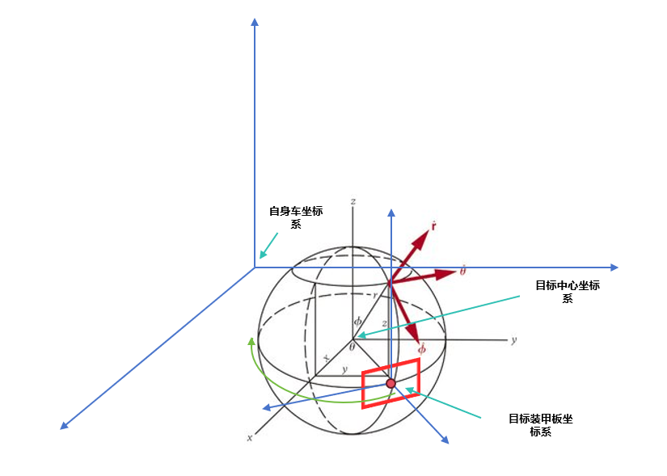
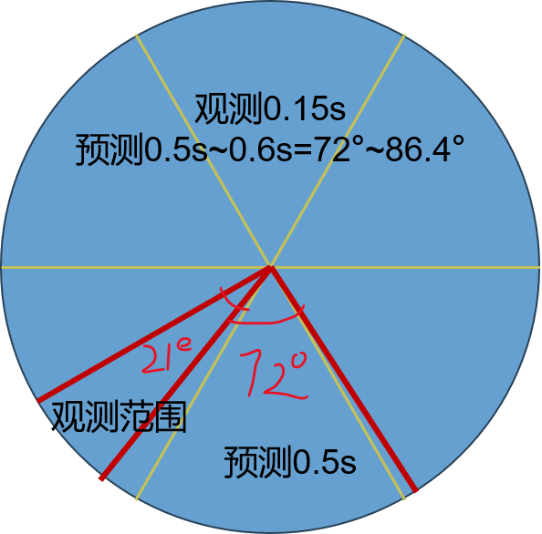

# ⭐️ **小白也能快速上手的全新(无需参考点, 基于物理约束，能量机关和自瞄均可预测)统一预测深度学习模型**
## ⭐️ **难道操作手还需要多一个按键选择自瞄还是能量机关？视觉还需要区分大小符以及写冗长的代码来判断旋转方向？小陀螺大符难道还要单独写EKF最小二乘以及PSO模型吗？距离太远，弹速不够，击打小陀螺需通过旋转方向提前预判下一个装甲板到来？**
### ⭐️ **现在统统不需要，即见即可预测，即使看不见也可以提前预判下一个目标到来，好try的不得了，快来试试吧！**
# *快速上手指南之python篇*
- ### *python 环境部署*
- 安装miniconda
- conda create -n rm python==3.9.1
- conda activate rm
- pip install -r requirements.txt
- 有gpu的请安装了自行安装cuda和cudnn以及pytorch的cuda版本。
- ### *命令行调用*
- 在conda创建rm环境目录下使用使用终端调用代码查看帮助信息
```bash
python aim_cmd.py -h 
```
- 首先做一个简单的补充说明，为下文能看懂我说什么做个铺垫。[a:dt:b]即从a到b的时间间隔为dt的时间序列数据左闭右开，假设dt=0.0125s,那么a:dt:b即为[a, a+dt, a+2*dt, ..., b-dt]的时间序列数据。
输入数据的格式为[样本数batchsize不用管, seq_len=input_size即收集的数据时序长度, feature_dim数据维度]，其中数据维度可以是3/4/6/7维的。
- 训练自己的数据集请保存文本格式数据集，支持四种数据集格式第一种[时间戳**t**, 自身车辆坐标系下的**x**, 自身车辆坐标系下的**y**, 自身车辆坐标系下的**z**, 旋转向量**rot**]单位默认是
[s, mm, mm, mm, rad]的n行7列的txt格式数据集, 第二种是[t,x,y,z]的n行4列的txt格式数据集，
第三种是[x,y,z]的n行3列txt格式数据集，第四种是已知旋转中心的坐标，或者已知一个固定参考点(雷达坐标系)[x, y, z, 参考点x, 参考点y, 参考点z]。对应的要改**feature_dim**=7/4/3/6。
- 下面展示采用[x,y,z]数据集的命令行，这种最方便。**data_path**就是你保存数据集的相对地址或者绝对地址。
**unit**=mm代表你的数据单位是mm，如果是m请使用**unit**=m具体参数详细意思参考aim_cmd.py的config介绍。
```bash
python aim_cmd.py mode=train input_dim=3 input_size=20 outputsize=10 offset=36 data_path=model/datasets/processed_log.txt unit=mm model_path=model/Total_predictor.pth
```
- 下面展示如何将训练好的模型去预测数据并查看效果
```bash
python aim_cmd.py mode=predict data_path=model/datasets/processed_log.txt unit=mm model_path=model/Total_predictor.pth
```
- 下面展示如何将训练好的模型导出为onnx和openvino模型
```bash
python aim_cmd.py mode=export data_path=model/datasets/processed_log.txt model_path=model/Total_predictor.pth 
```
- 如果没有自己的数据集也可以仿真生成数据集，下面展示如何生成装甲板数据集和能量机关数据集,但别忘记data_mode=vane_generate/armor_generate
```bash
python aim_cmd.py mode=vane_generate data_path=model/datasets/processed_log.txt unit=mm model_path=model/Total_predictor.pth
python aim_cmd.py mode=train data_mode=vane_generate input_dim=3 input_size=20 outputsize=10 offset=36 data_path=model/datasets/processed_log.txt unit=mm model_path=model/Total_predictor.pth
```
- **注:** 也可以直接对aim_cmd.py的default_config进行修改，修改后直接运行aim_cmd.py即可。
- ## *cmd配置参数说明*

| 参数名称 | 含义说明 | 可选值/格式                                                                                                     | 默认值 |
|---------|---------|------------------------------------------------------------------------------------------------------------|-------|
| **mode** | 运行模式 | `'train'`(训练), `'predict'`(预测), `'export'`(导出模型), `'vane_generate'`(能量机关数据生成), `'armor_generate'`(装甲板数据生成) | `'train'` |
| **data_path** | 数据集文件路径 | 文件路径字符串                                                                                                    | `'model/datasets/processed_log.txt'` |
| **feature_dim** | 数据特征维度 | `7`(t,x,y,z,rot), `6`(x,y,z,rx,ry,rz), `4`(t,x,y,z), `3`(x,y,z)                                            | `3` |
| **input_size** | 输入时间序列长度 | 整数 (示例: 20 =  收集[0: dt: input_size×dt]的数据)                                                                 | `20` |
| **output_size** | 预测时间序列长度 | 整数 (示例: 10 = 如果从输入0时刻开始计算，预测[input_size×dt+offset×dt: dt: input_size×dt+(offset+output_size)×dt]的数据)       | `10` |
| **offset** | 预测窗口时间偏移量 | 整数 (示例: 36 = 作为窗口偏置加速模型收敛跳过模型预测的时间窗口，[input_size×dt: dt: input_size×dt+offset×dt])                         | `36` |
| **batch_size** | 训练批大小 | 整数                                                                                                         | `1024` |
| **test_ratio** | 测试集比例 | 0-1之间的浮点数                                                                                                  | `0.2` |
| **epochs** | 训练轮数 | 整数                                                                                                         | `1000` |
| **lr** | 学习率 | 浮点数                                                                                                        | `0.001` |
| **patience** | 早停机制等待轮数 | 整数                                                                                                         | `30` |
| **model_type** | 使用的模型类型 | `'DualBranchTimeSeriesPredictor'`, `'vane_transformer'`                                                    | `'DualBranchTimeSeriesPredictor'` |
| **total_transformer_save_path** | 完整模型保存路径 | 文件路径                                                                                                       | `'model/vane_model/total_Predictor.pth'` |
| **vane_transformer_save_path** | 能量机关模型保存路径 | 文件路径                                                                                                       | `'model/vane_model/vane_Predictor.pth'` |
| **d_model** | Transformer特征维度 | 整数 (建议值: 256-512)                                                                                          | `256` |
| **n_heads** | 注意力机制头数 | 整数 (常用2的幂次)                                                                                                | `8` |
| **d_ff** | 前馈网络维度 | 整数 (能量机关建议256，自瞄建议512，也可以只训练一个自瞄和能量机关的整体512，不想调参就默认QWQ512)                                                 | `512` |
| **num_layers** | Transformer编码器层数 | 整数 (通常3-6层)                                                                                                | `3` |
| **eta_min** | 余旋退火最小学习率 | 浮点数                                                                                                        | `0.0000001` |
| **data_mode** | 数据类型模式 | `'txt'`(自建数据集), `'vane'`(能量机关数据), `'armor'`(装甲板数据)                                                         | `'txt'` |
| **unit** | 数据单位 | `'mm'`(毫米), `'m'`(米)                                                                                       | `'mm'` |
| **vision** | 预测模式是否显示可视化 | 布尔值                                                                                                        | `False` |
| **sample** | 数据采样数量 | 整数或`None`(全部数据)                                                                                            | `None` |

# 快速上手指南之c++篇
- ### *c++ 环境部署* 请拥有cmake,opencv以及openvino
- 安装openvino请使用openvino的归档文件安装且版本为2024.6.0。
- 在c++_AutoAim_example中build的终端中使用如下命令行即可完成示例操作。
```bash
cmake.. && make -j8 && ./Total3DAutoAim_CPPInference
```

# 代码的结构
- aim_cmd.py是模型的命令行调用代码，包含了模型的训练，预测，导出,生成模拟数据集功能。
- block.py是包含两种预测模型的主体代码，包含了模型的定义。
- train.py是自瞄和能量机关统一可以模型的训练代码，包含了模型的训练和验证过程。
已知固定参考点或者待击打中心目标坐标(能量机关)，可以通过进行归一化坐标使模型更好学习击打目标。(也可以未知R标当自瞄打，在真实数据集上精度会差个4mm左右)
如果设置model_type=vane_transformer此模型更加轻量化更加适合能量机关有参考点，但需要一个固定参考点才能完美收敛，注意需要进行归一化坐标。
如果设置model_type=DualBranchTimeSeriesPredictor也就是默认的模型，坐标单位要是mm，如果是m请选择unit=m,且该模型可以无参考点预测自瞄和能量机关效果毫不逊色有参考点。
- predict.py是模型的预测代码，包含了模型的预测过程,可以每个轴的mm误差。
- loss.py是模型的损失函数代码，包含了模型的损失函数的定义。
- export.py是模型的导出openvino模型的代码，包含了模型的导出过程。
- utils是模型的工具函数代码，包含了模型的工具函数的定义。其中generate_dataset.py和generate_dataset_vane.py分别是自瞄模拟数据集和能量机关模拟数据的生成代码。
- model是模型的目录，包含了训练好的测试模型，当然只是一种a和w的大符情况简单测试。其中datasets目录下包含了数据集，processed_log.txt是一个示例
数据集文件该数据集是能量机关大符的数据集x轴抖动±200mm,y和z抖动在±40mm左右所以loss理论最优是小于43,200但也不小太多 ，
可能是这个数据集的x轴太抖了就是深度太抖，但是模型仍旧可以滤波并预测，效果很不错。
- utils/vision_dataset.py可以显示北理珠友情提供的大符数据集的3d可视化。
- 
# ⭐️模型原理篇(不想了解的可以跳过了QWQ)
## 统一模型的结构
注:能量机关模型仅使用的x,y,z和transformerencoder的特征提取部分，输出为预测坐标数据属于统一模型的一部分因此不再介绍。主要介绍如何加强自瞄和能量机关同时都能学习的模型。
```mermaid
 graph TD
     A[输入数据 batch,seq_len,数据维度] --> B[Encoders特征提取]
     B -->|编码特征| C[pre_coords坐标预测分支]
     B -->|编码特征| D[class_fc分类预测分支]
     
 
     subgraph pre_coords坐标预测分支
         C --> C1[平移分支trans_fc]
         C --> C2[旋转分支rot_fc]
         C --> C3[半径预测radius_fc]
         C --> C4[装甲板初始角度预测]
         C2 --> |rot_vec| C5[生成旋转矩阵R]
         C3 --> C6[球坐标转换]
         C4 --> C6
         C6 --> C7[初始点p0]
         C5 --> C8[旋转点Rp0]
         C7 --> C8
         C1 --> C9[坐标合成]
         C8 --> C9
     end
     
     subgraph class_fc分类预测分支
         D --> D1[时间步压缩CBS_1D]
         D1 --> D2[Sigmoid分类]
     end
     
     subgraph 输出部分
         C9 -->|pred_coords| E[最终坐标 batch,pred_len,3]
         C1 -->|trans_out| F[平移输出 batch,pred_len,3]
         C2 -->|rot_vec| G[旋转参数 batch,pred_len,3]
         C3 -->|radius_pred| H[半径预测 batch,pred_len,1]
         D2 -->|class_pred| I[类别概率 batch,pred_len,1]
     end
 
     subgraph Encoders结构
         B1[线性投影 数据维度→d_model]
         B1 --> B2[多层Transformer编码器]
         B2 -->|输出| B3[编码特征 batch,seq_len,d_model]
     end
     
     style A fill:#f0f,stroke:#333
     style B fill:#FF9,stroke:#333
     style B3 fill:#9f9,stroke:#333
     style C fill:#99f,stroke:#333
     style C1 fill:#99f,stroke:#333
     style C2 fill:#99f,stroke:#333
     style C3 fill:#99f,stroke:#333
     style C4 fill:#99f,stroke:#333
     style D fill:#99F,stroke:#333
     style E fill:#f09,stroke:#333
 ```
### 了解模型搭建原理先验知识需要知道罗德里格斯公式(旋转向量转旋转矩阵)，旋转向量和旋转矩阵的定义和关系，平移向量的定义(可以参考https://zhuanlan.zhihu.com/p/141597984和https://zhuanlan.zhihu.com/p/433389563)
### 改进模型网络代码先验知识需要知道卷积和全连接，resnet，transformer，SGD，Adam,TCN即可。
- 模型的输入是[ batch=batch_size, seq_len=输入数据的时间步,这个可以自定义, 3=[[x-x[0],y-[0],z-[0]]],模型支持监督训练其他输出对应的loss，可以增加输入特征维度。
可以看出模型输入数据实际上是都减去的初始值也就是减去比如收集10个数据的初值(除旋转向量不减)，
因此我们数据的坐标系此时是第一个装甲作为初始点的坐标系，
也就是我下面图中写到目标装甲板坐标系，所以真实推理时需要保存第一个数据的值即为初值用来还原为自身车坐标系数据。
- 首先在目标车中心坐标系下预测装甲板的初始位置P0，具体为预测了装甲板的旋转半径radius以及球极坐标系下的倾斜角phi和方位角theta，映射为的xyz装甲板初始位置。
- 如果预测平面坐标预测一个角度即可(有尝试效果欠佳)，但是这样高度为0的预测效果较差，因为本身装甲板初始位置不一定在球xy平面上，而且球坐标不仅可以矫正初始装甲板位置也可以预测能量机关的初始相位和旋转。
```python
        x_coord = radius * torch.sin(phi) * torch.cos(theta)
        y_coord = radius * torch.sin(phi) * torch.sin(theta)
        z_coord = radius * torch.cos(phi)
```
- 然后再预测在目标车中心坐标系下旋转向量，具体为预测直接在旋转分支rot_fc预测了[pred_steps, 3]需要预测时间步(预测时间步=预测时间/帧平均时间dt，后面我有写具体怎么处理的，这个不是完全预测了加了offset)的旋转向量，
将旋转向量使用罗德里格斯公式变为旋转矩阵R，然后R*P0即可得到对应在目标车中心坐标系下的旋转预测。
- 最后就是预测平移向量trans[pred_steps,3]，即目标车辆中心在目标装甲板初始位置坐标系下的位置，将pred_coords = R*P0+trans即完成了在目标装甲板初始位置坐标系下的预测。然后取自己需要的时间步对应的pred_coords+之前保存的xyz的初值还原为自身车辆坐标系下预测坐标即完成了预测。
- 其实预测的平移向量在预测原地小陀螺时仅仅相当于将中心坐标系变成了装甲板初始位置坐标系下的旋转，但是在预测平移运动时预测的就是车辆中心在初始坐标系下的运动了，对于静止的目标其实相当于预测了一个半径为0的小陀螺，平移向量也会缩为0。
- 分类分支，可以自定义选择分什么类别，我原来分类的是能量机关小陀螺和平移静止什么的，分类效果非常之好(反正比状态机好)但是好像没必要分类，可以去掉分支。网络训练函数train.py默认freeze分类分支。
# 数据集的生成方式

## 真实数据集的采集和使用
- c++可以用cnpy库收集数据，数据的格式为npz格式，数据的格式
- c++代码cnpy的使用方法举例 但是收集的类别名称需要变成t,x，y，z，rot或者修改train.py中的create_dataset函数读取数据格式
- 也可以使用txt文本格式保存为,具体格式为[t,x,y,z,rot]的n行7列的txt格式数据集，或者[t,x,y,z]的n行4列的txt格式数据集，或者[x,y,z]的n行3列txt格式数据集,或者[x,y,z,参考点x,参考点y,参考点z]的n行6列txt格式数据集。
- 可以看model的model/datasets/processed_log.txt的数据集样式
- 推荐使用txt保存。
```cpp
        if (!all_tvecs.empty() && save_data && all_tvecs.size() % 100 == 0)
        {
            // 转换tvec数据格式
            std::vector<double> flat_tvecs;
            for (const auto &tvec : all_tvecs)
            {
                flat_tvecs.insert(flat_tvecs.end(), tvec.begin(), tvec.end());
            }

            // 转换时间戳数据
            std::vector<double> timestamps(all_timestamps.begin(), all_timestamps.end());

            // 创建形状向量（使用size_t类型）
            std::vector<size_t> tvec_shape = {all_tvecs.size(), 3};
            std::vector<size_t> ts_shape = {all_timestamps.size()};

            // 保存到npz文件
            cnpy::npz_save("tvec_data.npz", "tvecs", flat_tvecs.data(), tvec_shape, "w"); // 就是修改这里的名字
            cnpy::npz_save("tvec_data.npz", "timestamps", timestamps.data(), ts_shape, "a"); // 就是修改这里的名字

            std::cout << "Saved " << all_tvecs.size() << " samples" << std::endl;
        }
```
- 收集数据的是自身车坐标系下可以识别到的从红色点到绿色的时间戳，平移向量和旋转向量，预测的是装甲板坐标系下的红点的3d坐标。
- 数据的输入是先进行[t-t[0],x-x[0],y-y[0],z-z[0],rot旋转向量]的去处初始位置的预处理，然后输入模型，模型输出的是预测的坐标数据，旋转向量，平移向量，半径和分类，分类分支可以保留也可以去除。
- train.py中需要调节的参数的是config的配置参数，学习率采用的是余项退火初始学习率为5e-4，最小学习率为1e-4。
## 测试和仿真(生成的车辆坐标系xyz轴数据)
- 数据集的生成是通过对真实数据进行观察和统计，采用直接生成的方式。x和z的标准差在4mm左右，y的标准差在10mm左右。
- 其中包括小陀螺旋转与否以及其的方向，小陀螺旋转速度，车的随机初始位置，车上坡与否(决定y轴是否赋予速度)，车的速度，车的加速度等。
- 对三轴加了时间噪声，空间噪声。
- 其中时间噪声赋予为小陀螺角度随机噪声(用一帧时间(默认$\ dt=0.015s$,随机时间扰动$\pm2ms$)生成观察角度，模仿摄像头随机观测扰动等)，空间噪声赋予为小陀螺位置高斯噪声(其中包括z和x轴的$\sigma=1$，以及y轴的$\sigma=2$)。
- 模型训练时只做了$\ 第j样本的第i个点-第j样本的第1个点$的去处初始位置的预处理，因此模型推理时要自己这样预处理，输入模型，然后再将位置恢复到原来的位置。
### **注:** 模型未采用归一化等数据预处理方法，原因是数据集的生成是通过对真实数据进行观察和统计，采用直接生成的方式，因此数据集本身就已经是一个较好的分布。而且模型本身输入为tzxy数据，其中的xyz的量纲均是mm没有量纲差距，输入时便做了交叉项的特征工程，因此在尝试各种数据预处理后此种简单数据预处理是能使模型预测精度达到最优效果的方法。

## 数据集的分配
- 数据集分为训练集和验证集，训练集用于模型的训练，验证集用于模型的验证。
- 训练集和验证集的划分比例为8:2。
- 其中数据集每个类别起码需要4000个样本。
## 训练方法
- 模型训练时采用的是Adam优化器，学习率采用的是余项退火初始学习率为5e-4，最小学习率为1e-4。
## 训练损失权重分配
- 训练损失权重是一个超参数，用于平衡不同损失函数在训练过程中的影响力。
- 因此要平衡各个损失函数的权重，以确保模型在训练时不会过于偏向某个特定的损失函数，同时为了加速模型的收敛，刚开始一直训练到模型收敛为止。
### 具体超参数分配如下:
#### 1. 训练初期
- 模型根据此权重收敛后，loss会趋于平稳，loss的值会在一个范围内波动。此时预测的半径，旋转向量，平移向量，坐标数据等都能达到一个很不错的效果。
- coord_loss_weight=1.0, rot_loss_weight=10000.0, theta_loss_weight=5000.0
#### 2. 训练后期
- 为使得模型达到最优效果，此时只关注坐标损失即可。虽然因此会导致模型对旋转向量，平移向量，半径等的预测精度下降，但是由于模型是为了预测坐标数据，因此只关注坐标损失即可。
- coord_loss_weight=1.0, 其它权重=0.0
# 模型推理
- 模型推理时，输入数据为[t,x,y,z,rot]的七维数据，模型输出为坐标数据，旋转向量，平移向量，半径，分类数据。仅使用输出的坐标数据即可，在export.py中导出的模型仅保留了坐标预测的返回项。
- 记得要保留收集的模型输入长度的初始位置数据，模型推理后要将目标装甲板坐标系下的数据恢复到原来自身车辆坐标系下的位置。
- 此时便得到了三维自身车体坐标系下的要预测的坐标数据。
- 其中默认你会得到$predlen = 10$个预测点，假设offset=40(根据自己的需要调整，为什么不直接全部输出预测从0到预测时间步距为dt的数据呢？因为那样训练收敛很慢，你有offset作为偏执),dt=0.15s,那么模型输出的对应的是未来的$[offset*dt,(offset+predlen)*dt]=[40*dt，50*dt]$ (dt=0.015s，那么就是[0.6s,0.75s]的数据)的时间内的10个点的坐标数据。
- 预测范围和值可以根据自己的帧率和要预测多久的未来范围调整输出训练的范围，以及线性插值来选择间隔值预测得不到的值，比如你要预测的是未来[0.4s,0.5s]那么在dt=0.15s下$[offset*dt,(offset+pred_len)*dt]=[26*dt,34*dt]$，此时你可以选择offset=26,pred_len=8,其中经过测试这个模型预测[0s,1s]内都是准的，因此你可以将offset调大一些也可以。(注:但是pre_len最好不要调大了，不然模型训练不收敛）
- 模型推理时，坐标数据的单位是mm，旋转向量的单位是rad，平移向量的单位是mm，半径的单位是mm。
# 模型评估
- 模型评估时，使用均方误差(MSE)和平均误差(avg_error)作为评估指标,且仅是模型预测精度，模型本身便具有滤波作用，但还是建议加上一个防飘功能，因为该模型偶尔会飘。
- 模型速度仅是在不使用openvino量化和推理下测试结果，将模型转为openvino后大约会快两倍左右。我们推理使用的是1个batchsize，其他速度经供参考。
-  |

| 场景描述 | 小陀螺转速 (rad/s) | 车速 (mm/s)    | 旋转半径 (mm)  | MSE | avg_error (mm) | error < 10mm (%) | 10mm < error < 40mm (%) | 40mm < error < 62.5mm (%) | 62.5mm < error < 100mm (%) | 100mm < error < 150mm (%) | 150mm < error < 200mm (%) | error > 200mm (%) | 累计命中率为(error<62.5mm)(%) | 
|----------|---------------|--------------|------------|-----|----------------|------------------|-------------------------|---------------------------|----------------------------|---------------------------|---------------------------|---------------------------|-------------------------|
| 仅有小陀螺 | [0, 2π]       | 0            | [300, 500] | 384.70 | 15.324         | 41.73            | 53.46                   | 4.08                      | 0.68                       | 0.04                      | 0.00                      | 0.00                      | 99.28                   |
| 仅有车运动 | 0             | [1000, 2000] | 0          | 460.71 | 17.333         | 34.99            | 58.80                   | 5.73                      | 0.48                       | 0.00                      | 0.00                      | 0.00                      | 99.52                   |
| 静止      | 0             | 0            | 0          | 14.39 | 3.066          | 98.87            | 1.11                    | 0.02                      | 0.00                       | 0.00                      | 0.00                      | 0.00                      | 100                     |
### 该模型具有识别当前装甲板提前预测下一个装甲板的能力，且无需状态分类器，可以预测能量机关大小符正反转以及自瞄的装甲板的坐标数据。
- 下面的输入长度偏置以及预测长度偏置的设置仅是考虑击打同一个装甲板考虑
# 在dt=0.015s下inputsize,offset及pred_len设置
- inputsize，offset及pred_len的设置是为了让模型在推理时能够更好地适应不同的场景和需求。
- 其中预测最大度数+观测度数<90°，即$[(predlen+offset)*dt+inputsize*dt]/(2π/v_{rot})<120°/360°$，其中pred_len和offset的单位是帧数，dt的单位是秒。
## 英雄的推荐设置
- 由于英雄弹速上限为16m/s，假设弹速稳定在15m/s到16m/s之间，击打前哨站的距离为7.473m到9m之间，因此预测时间在[0.46s,0.6s]。
- 前哨站旋转速度为0.8πrad/s，则需要收集前哨站小陀螺小于1/6周的数据(t<0.4167s),由于dt=0.015s,则inputsize<27.8。以及切向要能够打到的因素，如图示例 |  |
- inputsize=10，offset=32,pred_len=10,相当于收集0.15s数据预测[0.48s,0.63s]的时间范围内的10个点的坐标数据。
- 此时对应的是观测了21.6°，预测了[72°,86.4°]。21.6+86.4=108°<120°，符合要求。
- 代价是只能打小陀螺和静止状态。
## 步兵和哨兵推荐设置
- 步兵弹速上限为25m/s，假设弹速稳定在20m/s到25m/s之间，击打前哨站的距离为3m到6m之间，因此预测时间在[3/25=0.12s,6/20=0.3s]。
- 假设小车旋转速度为1πrad/s，则需要收集前哨站小陀螺小于1/6周的数据(t<0.333s),由于dt=0.015s,则inputsize<22。
- inputsize=10，offset=8,pred_len=12,相当于收集0.15s数据预测[0.12s,0.3s]的时间范围内的8个点的坐标数据。
- 此时对应的是观测了27°，预测了[21.6°,54°]。27+54=81°<90°，符合要求。

# 其他
- 这个代码很遗憾没有上车完全测试，仅有几个测试视频可以参考，本来是想要尝试替代自瞄和开符的状态分类以及卡尔曼的建模给robomaster带来新的方案，但由于时间紧迫以及需要考研复习，因此这个科研结果变告一段落了。
- 我使用了网上开源的Informer CrossFormer TCN TimesNet Autoformer CNN-Lstm CNN-BiLSTM等这些模型不外乎要不就是模型太大，要不然就是自回归模型耗时太长，以及效果较差无法适用于我们的这个会跳变的任务。
因此我创建了这个由物理约束的模型，当然也仅仅是一个尝试，虽然效果还不错，但还是希望能有更好的模型来替代这个模型。
- 其中这个模型的问题是，我有尝试用用激活函数去限制住回归分支角度回归的边界，但是可能是因为tanh函数的两端梯度消失的问题反而效果更差了，我也尝试了用DFL将回归变为分类问题，这样解决的啦边界又提升了训练速度，但是DFL受限于步距精度的限制效果稍于直接使用回归的效果。
还有如果我们提前知道了目标车的半径和中心坐标，对目标车装甲做半径归一化处理平移向量，就是将其变为目标车坐标系，且半径为1的情况，会加速收敛，这是我在预测能量机关时候发现的，这时大符预测效果会得到极大提升。当然我猜测是因为有参考点那么模型相当于在同一个旋转样本预测时不用预测不同的平移向量和初始点，因为我有尝试随机固定一个参考点去预测，效果跟用旋转中心是差不多的。
不过如果数据集足够大我发现最后都能收敛到一样的好的loss，但是有参考点收敛所需的数据集比无参考点的要少。而有参考点的loss下降非常稳定，但没有无参考点收敛速度快，效果差4mm左右。
- 但是我想写这个模型的初衷便是不想要知道车中心坐标或者能量机关的R标位置或者一个参考点以及半径信息，仅通过装甲板的平移和旋转来预测装甲板的各种信息，以便于预测坐标数据。
因此我猜想的这个有点冗余的分类器在识别小陀螺分类时或许可以将参考点固定预测？但是训练的时候怎么做呢？我也不知道。
- 或许没办法两全其美吧，希望大家有更好的办法来解决这个问题。
## *打了两年的感想*
- 从大一接触深度学习到大四，大一第一次创建的环境就叫作YOLOv5，也是我梦开始的地方。 
- 最开始的我写不出来一个完整的代码，慢慢到写出来的代码十分难以入目漏洞百出和大神的相差甚远。到后来大二加入了rm，第一次可以一个人完整的写一个项目，这种感觉很神奇，但又很无助，没有方向也没有引导，在此期间多亏网上李宏毅和噼里啪啦老师的讲解才能使我初窥深度学习的大门。也是在同年大二能够完整的理解并轻量化resnet模型给同学写一个简单的装甲板分类网络。学了那么久那是第一次觉得搞深度学习是非常有成就感的事情。 
- 同样也是在同年，作为大二正式队员需要去完成能量机关的任务。多亏了西北工业大学的能量机关开源，给我当时没有任何代码框架的我指引一盏微小的明灯，虽然我不认识写这个代码的人，但是我由衷的感谢。 
- 再然后我觉着这是一件非常有愧于我学习很久深度学习的一件事情，那便是使用yolov8，当时的我并不知道转成ir模型会变快两倍，也不知道转成tensorrt在Orion上会快三倍，我只是转成了onnx，这件事是我大三才知道的事情，这令我深感愧疚。但也是第一次在一个有丰富下游任务的深度学习模型上进行了许多改进用处不是很大但会增加计算量的改进，最后也只能减小输入分辨率来降低计算量的无用改进。但是也是因为当时能力有限，做不到去除nms后处理。因为我们的任务就是单目标单标签匹配。所以到后来YOLOv10和DETR的出世，我才明白了如何去除后处理，也就是如何单对双标签匹配。（和单匹配单是一样的） 
- rm被打回家后，便就是大三考研了。很不幸我考研只努力了三个月，因为前面的我以为考的专业方向很简单，便前松后紧，最后紧赶慢赶勉强学完第一遍便上考场了。最终也是很倒霉的差几分没考上，毕竟我学习本身就一般，加上英语很差，人还不努力没考上实属正常。 
- 不过也因为如此多了一段空档期，是一段自以为是能勉强够到学校的空档期。因此我便开了实验了一个新的自瞄和能量机关的统一模型，这非常感谢我们实验室的陈云锋和龚伟豪，他们愿意尝试实验新的模型和想法，即使最后没有完成，但也因此让我改进了从平面预测到球面预测的方案。到后面北理珠刘泓禹提供能量机关大符的真实数据也更加验证了深度学习可能才是rm需要科研的方向。而不是抱守着不变的yolox，ekf，pso，决策树，状态机，之类的方案，是需要新人去尝试零样本弱监督，强化学习，rm是需要创新和改革，我相信有很多强校在做强化学习的尝试，也希望有一天能看到rm的开源深度学习端到端方案的实现。 
- 回想从当时接触了深度学习再到能完整的写出深度学习领域的yolov5，扩散模型，gan，transformer，vit，BEV这些经典网络框架，再到可以独立研发一个新的应用类模型，时间过的真的好快。 
- 终于也是要毕业了，这也是我第一次完完整整的写下一个有效的开源模型，从YOLOv5环境开始也是从YOLOv5环境告别一段落了。同时也是告别了铁人战队的实验室，在这里我收获了很多友谊(PS:以及通过rm我也结交了许许多多的好朋友🌹)，也认识了非常好的指导老师超哥和靳老师，也收获了我喜欢的她，她也喜欢我的女朋友邓琴琴。最最后希望rm越办越好，希望铁人战队可以一直延续下去，越来越强。
- 最最最后如果大家给我一个star，那我将非常感谢🙏🏻
# 声明
本代码仅供学习使用，未经授权，禁止用于商业用途或其他未经授权的用途。作者：张子祺。侵权必究。如有漏洞，或者知道如何解决欢迎与作者讨论，联系方式:QQ: 2482947816，微信: 15081084305。